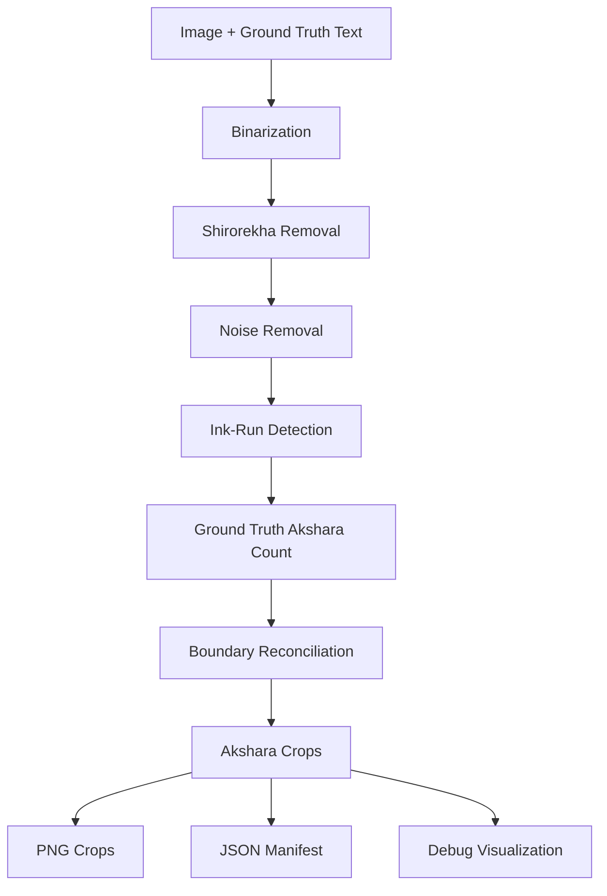

# Devanagari Akshara Segmentation

A ground-truth-guided computer-vision pipeline for segmenting Devanagari/Sanskrit word images into individual **aksharas (visual character clusters)**.

## Project Structure

```text
character-segmentation/
├── README.md
├── requirements.txt
├── main.py
├── .gitignore
├── src/
│   ├── __init__.py
│   └── segmentation.py
├── notebooks/
│   └── Untitled3.ipynb
├── input/
│   └── <image>.jpg + <image>.txt
└── output/
    ├── character crops
    ├── *_segmentation_debug.png
    └── *_manifest.json
```

## Installation

```bash
python -m venv .venv
```

Windows:

```bash
.venv\Scripts\activate
```

Install dependencies:

```bash
pip install -r requirements.txt
```

## Input Format

For each image, provide a matching UTF-8 ground-truth text file:

```text
input/
├── line_0.jpg
├── line_0.txt
├── line_1.jpg
└── line_1.txt
```

The image and text must have the same filename stem.

## Run

For JPG images:

```bash
python main.py input output --pattern "*.jpg"
```

For PNG images:

```bash
python main.py input output --pattern "*.png"
```

The program saves character crops, a segmentation-debug image and a JSON manifest in `output/`.

## Pipeline



## Method

The implementation in `src/segmentation.py` follows the notebook's existing approach:

1. Otsu binarization with automatic polarity detection.
2. Morphological closing for small texture/anti-aliasing gaps.
3. Shirorekha/headline connected-component removal.
4. Resolution-relative noise removal.
5. Optional multi-word splitting using large horizontal gaps.
6. Column-wise ink projection and detection of zero-ink runs.
7. Ground-truth akshara extraction using a Devanagari Unicode regex.
8. Reconciliation of detected runs with the expected akshara count.
9. Tight character cropping.
10. Saving crops, JSON metadata and a debug visualization.

This is a **heuristic computer-vision pipeline, not a trained machine-learning model**.

## Notebook

The original experimental notebook is retained under `notebooks/Untitled3.ipynb`. The reusable implementation has been moved into `src/segmentation.py`, while `main.py` provides a clean command-line entry point.
