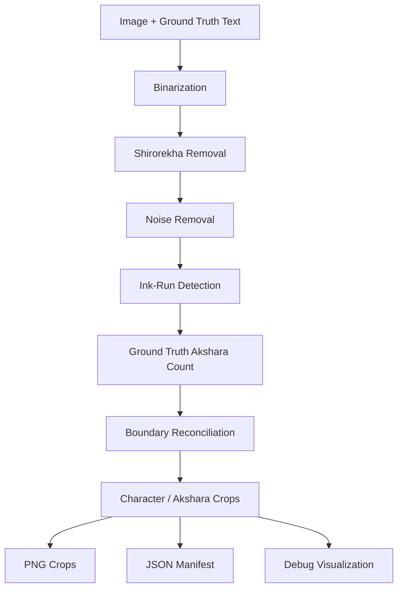
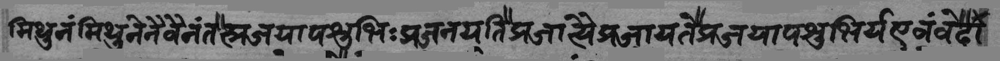
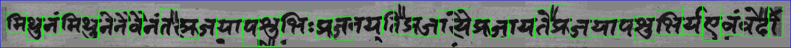
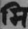
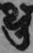
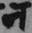

## Devanagari Akshara Segmentation

*A computer-vision pipeline for segmenting Devanagari/Sanskrit word images into individual aksharas (visual character clusters) using ground-truth text as guidance.*

## Pipeline Structure :-

The core idea is:

# Project Structure

A typical input/output structure is:

~~~project/
│
├── Character Segmentation
│
├── input/
│   ├── line_0.jpg
│   └── line_0.txt
│   
│    
│
└── output/
    ├── line_0_w0_c0_<akshara>.png
    ├── line_0_segmentation_debug.png
    └── line_0_manifest.json
~~~

*Each image should have a matching .txt file containing its ground-truth text.*

Important Limitation

The segmentation is ground-truth guided.
The ground truth provides the expected akshara count and labels. Image evidence is then used to determine where the boundaries should be placed.
Therefore, this implementation should not be interpreted as a completely text-independent character segmentation system.
# The python documentation recommends checking the generated:
# *_segmentation_debug.png
on a sample of images and adjusting SegmentConfig parameters when necessary.

## Results

### Input and Segmentation Debug

  
  &nbsp;&nbsp;&nbsp;&nbsp;&nbsp;&nbsp;
  

 

### Segmented Characters

  
  &nbsp;&nbsp;&nbsp;&nbsp;&nbsp;&nbsp;
  
  &nbsp;&nbsp;&nbsp;&nbsp;&nbsp;&nbsp;
  

# Future Improvements

*Possible improvements include:*

*More robust handling of touching/fused characters *

*Better detection of matras and detached components *

*Adaptive boundary scoring *

*Font-specific or style-aware segmentation *

*Quantitative segmentation evaluation against annotated boundaries *

*Integration with a trained OCR/character-recognition model *

*Improved handling of handwritten and highly stylized Devanagari text *

